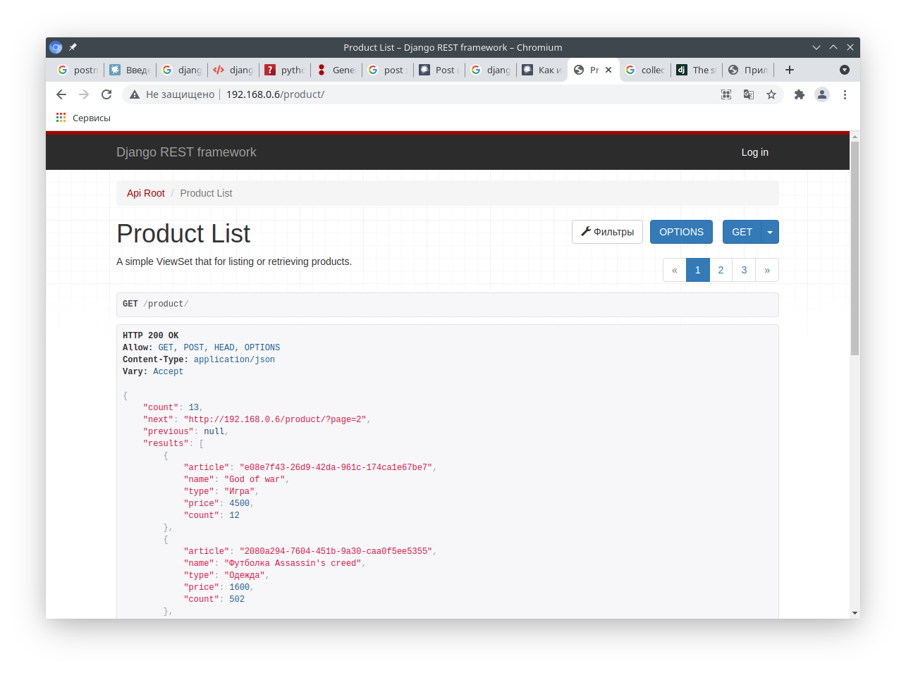
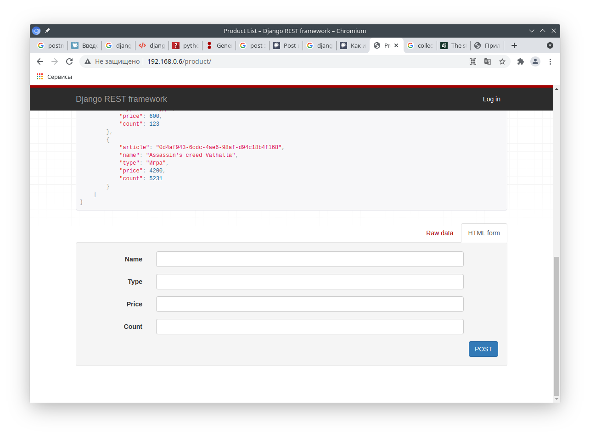
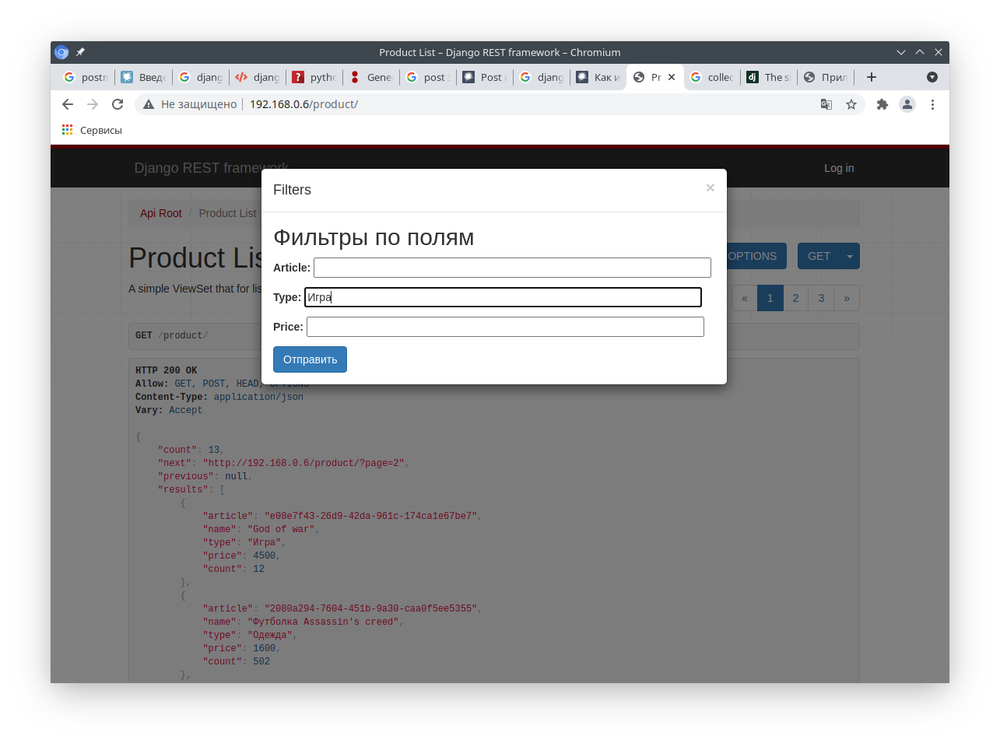
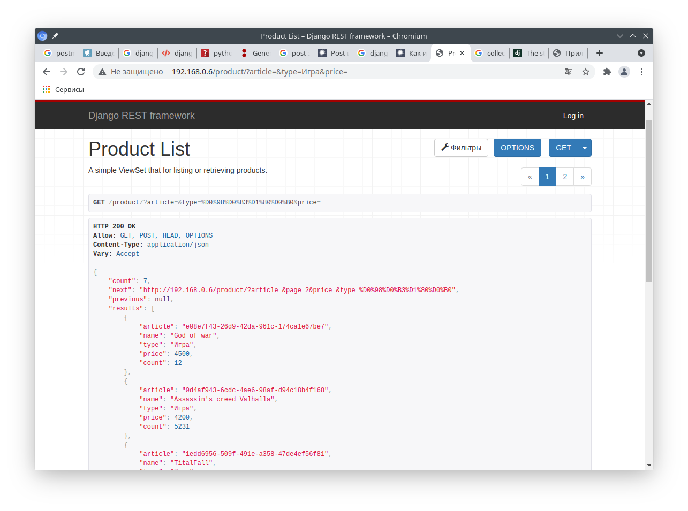
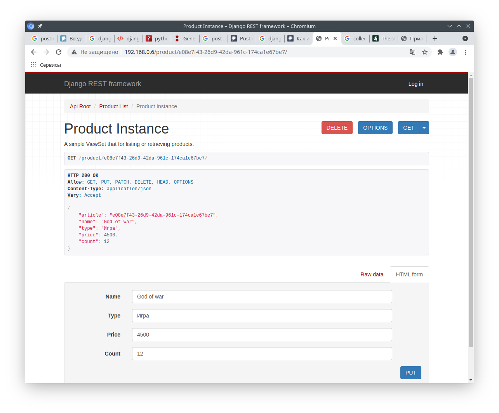
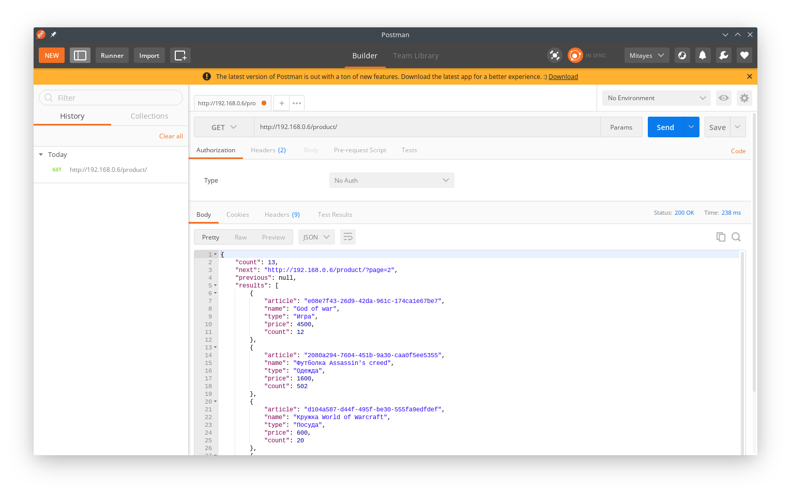
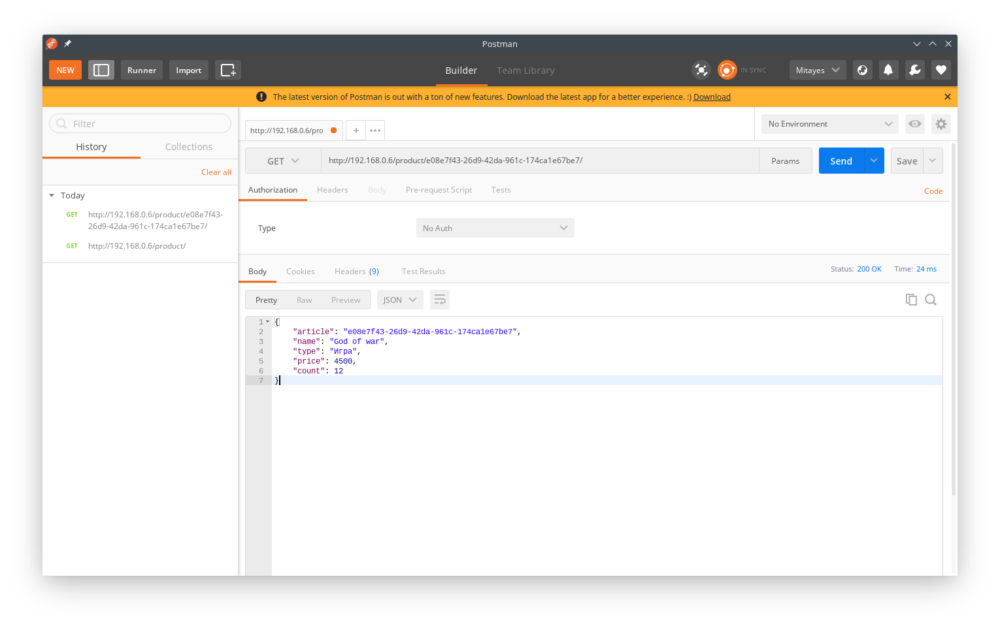
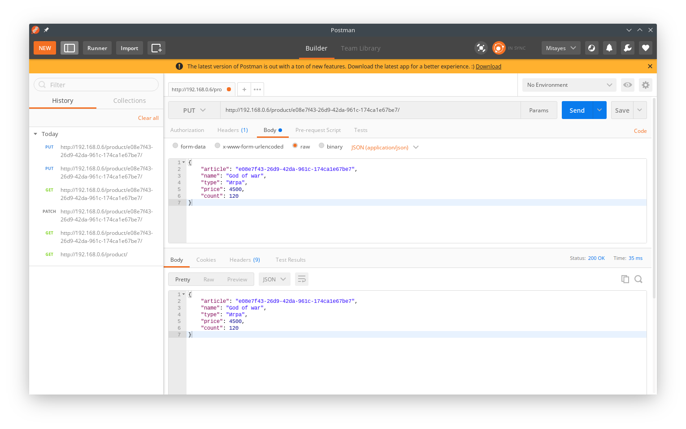
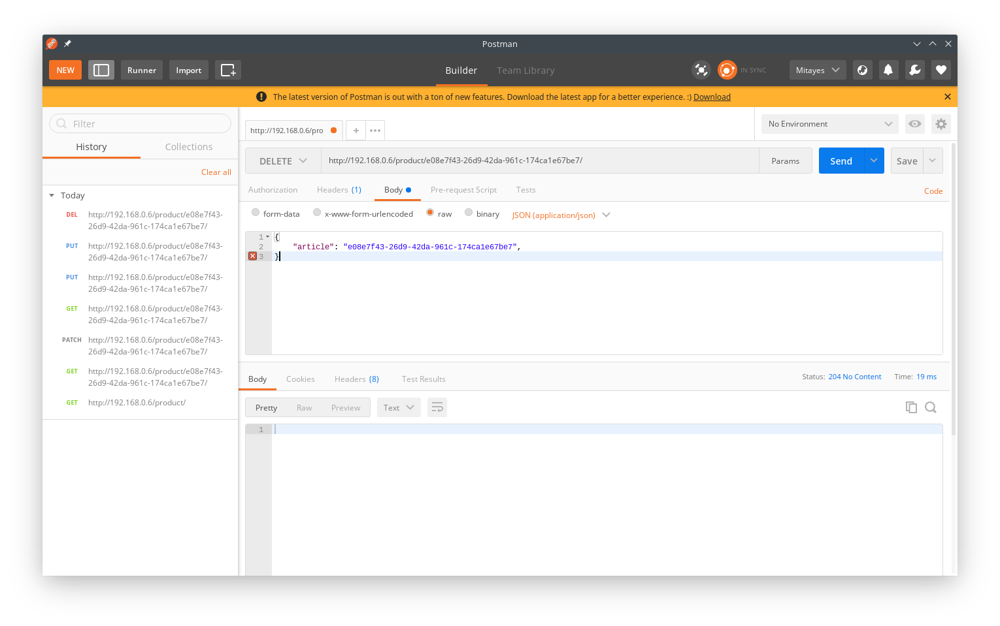

# Xsolla School 2021. Backend (тестовое задание)
  
# Назначение проекта
Проект подготовлен в рамках реализации задания из вступительного теста для курса **"Xsolla School 2021. Backend"**

# Описание проекта
Проект реализует API для доступа и управления базой данных (БД), содержащей товары, которые могла бы продавать компания, реализующая Видеоигры и различный мерч.  
БД содержит одну таблицу со следующими полями:
  - article - Уникальный идентификатор (создаётся автоматически)
  - name - Наименование товара
  - type - Тип товара (категория)
  - price - Цена товара за единицу
  - count - Количество товара в наличии
  Доступна фильтрация по полям 'article', 'type', 'price'  
  
**Реализованы**  
- Пагинация (количество результата на странице задаётся параметром `PAGE_SIZE` переменной `REST_FRAMEWORK` в )
- Фильтрация по полям 'article', 'type', 'price'
- Методы API CRUD
- Возможность развёртывания web-сервиса средствами Docker-compose (в режиме отладки средствами django)
  
**Не успел**
- Разобраться со статическими файлами (для запуска в продуктовом режиме). Статика собирается в отдельную папку, но запущенный сервер её не видит
- Настроить Gunicorn для запуска workers
- Настроить дополнительным контейнером nginx
  
# Использованные технологии
## Тестовый полигон  
Виртуальная машина на базе Virtualbox  
**Operating System**: Debian GNU/Linux 10 (buster)  
**Kernel**: Linux 4.19.0-13-amd64  
**Architecture**: x86-64  
  
## Разработка  
- Python версии 3.9.6 (3.8 должна подойти)
- PyCharm 2021.1.3 (Community Edition)
- Django==3.2.5
- django-filter==2.4.0
- djangorestframework==3.12.4

## Эксплуатация
- git version 2.20.1
- Docker version 20.10.2, build 2291f61
- docker-compose version 1.25.3, build d4d1b42b

# Порядок развёртывания
## Развёртывание в Docker  
На машине с установленным Docker и Docker-compose  
1. Создаём папку, в которую будем клонировать репозиторий git и переходим в неё  
`mkdir /home/xsolla_web && cd /home/xsolla_web`
2. Клонируем репозиторий  
`git clone https://github.com/Mitayes/xsolla_backand.git`
3. Переходим в папку с репозиторием
`cd xsolla_backand`
4. Собираем контейнер  
`docker-compose build`  
В этот момент может сругаться на версию `docker-compose`, указанную в файле `docker-compose.yml`. Терминал сам подскажет какая версия допустима для вашего docker-compose
>Either specify a supported version (e.g "2.2" or "3.3")
5. Редактируем конфигурационные файлы:  

**/.env.dev**  
  
Задаёт такие параметры как:
  - DEBUG - запуск сервера в режиме отладки (0 - нет, 1 - да)
  - SECRET_KEY - Здесь нужно указать без апосрофов и кавычек секретный ключ Django проекта
  - ALLOWED_HOSTS - Здесь нужно указать через пробел IP-адреса, с которых будет доступен веб-сервер (например: `localhost 192.168.1.2`)  
  
**/docker-compose.yml**  
  - version - версия docker-compose.yml (определяется версией docker-compose)
  - ports - порт, на котором web-сервер будет принимать запросы (слева от двоеточия указывается порт хоста). В моём случае прослушивается http порт 80

**Запускаем контейнер**
`docker-compose up -d`

API доступен по ссылке http://IP-адрес-сервера/product/ в т.ч. и через браузер (имеются html странички для работы с базой через формы)

**Для остановки**
`docker-compose down`

## Развёртывание на локальной машине
Для этого необходимо:
1. Установить Python версии 3.9 (или 3.8) 
2. Создать папку для проекта и перейти в неё  
`mkdir /home/xsolla_web`  
3. Клонировать репозиторий и перейти в папку с ним  
`git clone https://github.com/Mitayes/xsolla_backand.git`
4. установить зависимости из 
5. Раскомментировать переменные для локального запуска и закомментировать те, что используются для docker (в комментариях это указано) в   
```
# Для развёртывания на локальной машине
SECRET_KEY = 'django-insecure-czb8ph!6(0myzc*csah-jfvjl*py0$5(dpb_&mg0wr*h6re*4p'
# Для развёртывания в Docker
# SECRET_KEY = environ.get('SECRET_KEY')

# Для развёртывания на локальной машине
DEBUG = False
# Для развёртывания в Docker
# DEBUG = int(environ.get('DEBUG', default=0))

# Для развёртывания на локальной машине нужно внести IP-адрес машины, по которому она доступна в сети
ALLOWED_HOSTS = ['localhost', '0.0.0.0']
# Для развёртывания в Docker
# ALLOWED_HOSTS = environ.get('ALLOWED_HOSTS').split(' ')
```
6. Находясь в папке с файлом  выполнить команду  
  
`python manage.py runserver 0.0.0.0:8000`

# Демонстрация web части API
Главное окно (GET)  

Главное окно (INSERT)  

Фильтрация

Фильтрация применена 

Удаление / обновление (DELETE / UPDATE)  


# Демонстрация работы API средствами postman
GET

GET по UUID

UPDATE

DELETE

INSERT 

